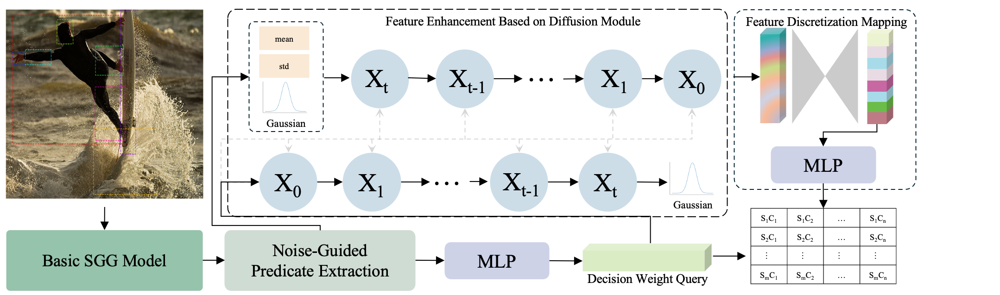
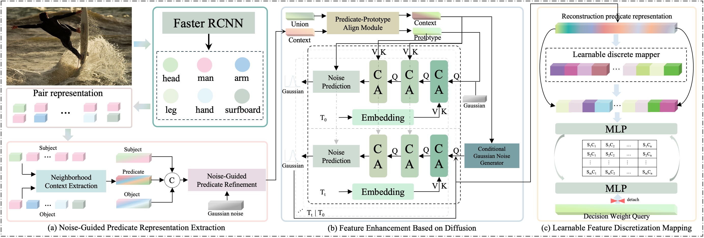

# Noise-Guided Predicate Representation Extraction and Diffusion-Enhanced Discretization for Scene Graph Generation (NoDIS)

The implementation code for the paper "[Noise-Guided Predicate Representation Extraction and Diffusion-Enhanced Discretization for Scene Graph Generation](https://openreview.net/pdf?id=tkDtiOeLtx)"

🎉 This paper has been accepted by ICML2025  [](./Noise_Guided_Predicate_Representation_Extraction_and_Diffusion_Enhanced_Discretization_for_Scene_Graph_Generation.pdf)

<p align="center">
  
</p>

<p align="center">
  
</p>


## ✅ TODO
- [x] upload code (Inference using DDPM)
- [x] Update the inference method and introduce the DDIM denoising method

## Installation
Check [INSTALL.md](./INSTALL.md) for installation instructions.

## Dataset
Check [DATASET.md](./DATASET.md) for instructions of dataset preprocessing.

## Train and Test
We provide [scripts](./scripts/train.sh) for training and testing the models

## Device
All our experiments are conducted on one NVIDIA GeForce RTX 3090, if you wanna run it on your own device, make sure to follow distributed training instructions in [Scene-Graph-Benchmark.pytorch](https://github.com/KaihuaTang/Scene-Graph-Benchmark.pytorch).

## Quantitative Analysis
For the quantitative evaluation results presented in the paper, we provide the [computation code](./tools/quality_assessment.py).

## Help

Be free to contact me (`guoqing.zhang@bjtu.edu.cn`) if you have any questions!

## Acknowledgement

The code is implemented based on [PENet](https://github.com/VL-Group/PENET) and [Scene-Graph-Benchmark.pytorch](https://github.com/KaihuaTang/Scene-Graph-Benchmark.pytorch).

## Citation
If you find this project useful for your research, please kindly cite our paper:

```bibtex
@inproceedings{zhangnoise,
  title={Noise-Guided Predicate Representation Extraction and Diffusion-Enhanced Discretization for Scene Graph Generation},
  author={Zhang, Guoqing and Kan, Shichao and Zhang, Fanghui and Xu, Wanru and Zhang, Yue and Cen, Yigang},
  booktitle={Forty-second International Conference on Machine Learning}
}
```
